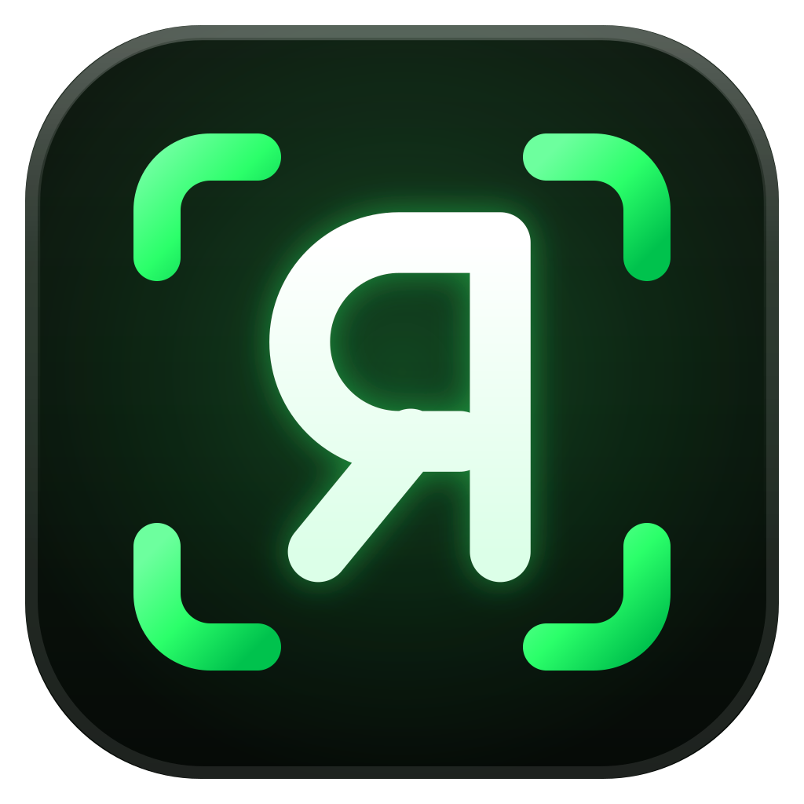

<div align="center">



# rever-browser

### API 리버스 엔지니어링을 위한 AI 브라우저.

[](./LICENSE)
[](https://github.com/greekr4/rever-browser/releases/latest)

**[🌐 웹사이트](https://greekr4.github.io/rever-browser/)** / **[⬇ macOS 다운로드](https://github.com/greekr4/rever-browser/releases/latest)** / **[⬇ Windows 다운로드](https://github.com/greekr4/rever-browser/releases/latest)**

[English](./README.md) · [데모](#데모) · [소개](#rever-browser란) · [기능](#기능) · [시작하기](#시작하기) · [아키텍처](#아키텍처)

</div>

---

## 데모

<div align="center">

[](https://greekr4.github.io/rever-browser/demo.mp4)

**자연어로 지시만 하면, 에이전트가 실제 브라우저를 직접 조작해 API 결함을 찾아내고, 실시간으로 증명한 뒤, 원클릭 매크로로 만들어줍니다.**

[▶ 전체 데모 보기](https://greekr4.github.io/rever-browser/demo.mp4)

</div>

## rever-browser란?

`rever-browser`는 실제 Chromium 탭과 ACP 기반 코딩 에이전트를 결합한 Electron 앱입니다. 사용자는 앱에 내장된 `<webview>`에서 대상 사이트를 탐색하고, 앱은 Chrome DevTools Protocol을 통해 모든 네트워크 요청을 캡처합니다. 에이전트는 이 트래픽을 읽고, 사이트의 자바스크립트 번들을 분석하며, 인프로세스 MCP 도구 서버를 통해 탭 자체를 직접 조작할 수도 있습니다. 목표는 "이 사이트는 어떤 요청을 보내는가?"에서 "이 API를 어떻게 재현하는가?"까지, 앱을 벗어나지 않고 도달하는 것입니다.

## 기능

- **실시간 트래픽 캡처** — 탐색 중인 탭의 모든 `Network.*` 이벤트가 링 버퍼에 기록됩니다. 응답 본문은 지연 로딩되며, image/video/font/CSS 페이로드는 버퍼를 가볍게 유지하기 위해 건너뜁니다.
- **AI 에이전트 채팅** — 캡처된 트래픽을 보고 페이지에 직접 작업을 수행할 수 있는 코딩 에이전트와 대화합니다. 기본값은 Claude Code이며, Codex도 지원합니다.
- **ACP 또는 터미널 모드** — 구조화된 ACP 채팅과, 로컬 Claude Code CLI를 실행하는 실제 터미널 사이를 전환할 수 있습니다. rever의 MCP 서버가 자동으로 연결되어 CLI 에이전트도 동일한 브라우저/트래픽 도구를 사용할 수 있습니다.
- **브라우저 자동화** — 에이전트가 실시간 탭에서 이동, 클릭, 입력, 스크롤, 스크린샷, 접근성 스냅샷 촬영을 수행할 수 있습니다.
- **번들 분석** — 이미 트래픽 저장소에 캡처된 자바스크립트를 재다운로드 없이 grep·추출·번들러 감지·역난독화합니다(`webcrack` 기반 역난독화 포함).
- **심층 API 도구** — 요청 리피터, 인트루더, 헤더/오버라이드 편집, HAR 내보내기, 소스맵 복구, 암호화/디코딩 헬퍼, WebSocket 및 서비스 워커 검사 등 광범위한 MCP 도구 세트를 제공합니다.
- **브라우저 프로필** — 이름이 지정된 영구 프로필 또는 시크릿 프로필. 각각 독립된 쿠키/스토리지 저장소를 가지며, 탭 바에서 원하는 프로필로 새 탭을 열거나 실제 브라우저 프로필 이름으로 시드된 프로필을 생성할 수 있습니다.
- **쿠키 가져오기** — Chrome, Edge, Brave, Arc, Chromium, Vivaldi, Firefox, Safari(macOS)에서 로그인된 세션을 활성 프로필로 가져올 수 있습니다. 소스 브라우저와 프로필을 표시 이름으로 선택합니다.
- **캡처 & 마크업** — 페이지의 어떤 요소든 클릭해 스크린샷과 컨텍스트(선택자, ref, 태그, 텍스트)를 캡처합니다. 컨텍스트는 채팅으로 전달되어 에이전트가 사용하고, 스크린샷은 마크업 에디터에서 사각형·화살표·자유 필기 주석을 추가한 뒤 클립보드로 복사하거나 저장할 수 있습니다.

## 요구 사항

- [Bun](https://bun.sh) (패키지 매니저로 사용 — npm/pnpm 아님)
- Node.js (아래 ACP 에이전트 바이너리용)
- **PATH에 필요한 에이전트 바이너리:**
  - `claude-agent-acp` — 기본 Claude Code 에이전트에 필요
    ```bash
    npm i -g @agentclientprotocol/claude-agent-acp
    ```
  - `codex-acp` — Codex 에이전트에 필요
    ```bash
    npm i -g @agentclientprotocol/codex-acp
    ```
- PATH에 `webcrack` (선택) — `deobfuscate_script` 도구를 활성화합니다

## 시작하기

**바로 사용해보고 싶다면?** [최신 릴리스](https://github.com/greekr4/rever-browser/releases/latest)를 내려받고 에이전트 바이너리를 설치하세요 — [요구 사항](#요구-사항) 참고:

- **macOS** (Apple Silicon 또는 Intel `.dmg`) — Applications 폴더로 드래그하세요. 서명되지 않은 앱이므로, 처음 실행할 때는 앱을 우클릭 → **열기**를 선택하세요.
- **Windows** (`-setup.exe`) — 설치 프로그램을 실행하세요. 서명되지 않은 앱이므로, SmartScreen 경고가 뜨면 **추가 정보 → 실행**을 클릭하세요.

**소스에서 빌드하기:**

```bash
bun install      # 의존성 설치
bun run dev      # electron-vite dev 실행 (main + preload + renderer, HMR 포함)
```

기타 명령어:

```bash
bun run build      # out/ 에 프로덕션 빌드 생성
bun run typecheck  # tsconfig.node.json + tsconfig.web.json 타입 체크
```

main 또는 preload 프로세스 코드를 수정했는데 HMR이 반영되지 않으면, Electron 프로세스를 종료하고 `bun run dev`를 다시 실행하세요:

```bash
pgrep -f "Electron|electron-vite" | xargs -r kill -9
```

## Claude Code에서 Rever 사용하기 (`/rever` 스킬)

Rever는 Claude Code 스킬을 함께 제공하여, 어떤 `claude` 세션에서든 실행 중인 Rever Browser를 조작하고 API 리버싱을 위한 약 140개의 MCP 도구를 사용할 수 있습니다. 별도 저장소 [greekr4/rever-browser-skill](https://github.com/greekr4/rever-browser-skill)로 배포되어 있으며, [`skills`](https://www.npmjs.com/package/skills) CLI로 설치할 수 있습니다(소스 체크아웃 불필요 — DMG/EXE 사용자도 바로 사용 가능):

```bash
npx skills add greekr4/rever-browser-skill --global --agent claude-code
```

**사용법:** Rever Browser 앱을 실행하면(시작 시 MCP 엔드포인트를 게시합니다) 어떤 `claude` 세션에서든 다음을 입력하세요:

```
/rever
```

이 스킬은 앱의 엔드포인트를 찾아 네이티브 MCP 도구로 등록하거나(`claude mcp add --transport http rever …`) 번들된 `rever.py`를 통해 도구를 직접 호출합니다. 현재는 macOS만 지원합니다(엔드포인트 경로가 `~/Library/Application Support/` 하위에 있음). `skills/rever/` 아래의 저장소 내 사본은 해당 저장소로 미러링되는 개발 소스입니다.

## 사용법

1. `bun run dev`로 앱을 실행합니다.
2. 내장 브라우저에 URL을 입력하고 대상 사이트로 이동합니다.
3. 사이트를 조작하면 요청이 트래픽 목록에 실시간으로 표시됩니다.
4. 채팅 패널을 열고 에이전트(Claude Code 또는 Codex)를 선택한 뒤, 캡처된 트래픽에 대해 질문합니다 — 예: 특정 엔드포인트 설명, 인증 흐름 재구성, 요청을 재현하는 클라이언트 코드 생성 등.
5. 에이전트는 트래픽 저장소를 읽고 MCP 도구를 통해 탭을 조작하며 답변합니다.

## 아키텍처

세 개의 Electron 프로세스가 엄격히 분리되어 있으며, 프로세스 간 작업은 모두 preload IPC를 통해 이루어집니다.

- **main** (`src/main/`) — Node + Electron API. `<webview>`의 CDP 디버거를 소유하고, ACP 에이전트 프로세스를 스폰하며, 에이전트가 콜백으로 호출하는 인프로세스 HTTP MCP 서버를 호스팅합니다.
- **preload** (`src/preload/index.ts`) — 렌더러에 노출되는 표면의 단일 진실 공급원(source of truth)으로, `contextBridge`를 통해 `window.rev`로 노출됩니다.
- **renderer** (`src/renderer/src/`) — React 19 + Vite. `<webview>` 태그와 채팅 UI를 호스팅합니다.

### 데이터 흐름

**트래픽 캡처:** `webview Network.* 이벤트 → main/chrome-cdp.ts → main/traffic-store.ts → renderer (TrafficList)`

**에이전트 루프:** `ChatPanel → ACPChatTransport → preload IPC → main/acp-session.ts → ACP 에이전트 자식 프로세스 → MCP 도구 → main/mcp/server.ts → traffic-store 조회 / CDP 조작`

MCP 서버는 첫 에이전트 스폰 시 지연 시작되며 임의의 localhost 포트에 바인딩됩니다. 추가 설계 노트는 `docs/`를 참고하세요.

## 라이선스

[Apache-2.0](./LICENSE) — 저작자 표시는 [NOTICE](./NOTICE)를 참고하세요.

## 서드파티 라이선스

모든 의존성은 [`package.json`](./package.json)에 명시되어 있으며, 의존성 트리의 모든 패키지는 permissive 라이선스(MIT, Apache-2.0, ISC, BSD)를 사용합니다 — copyleft 라이선스는 없습니다.

별도 프로세스로 호출되는 외부 도구(이 프로젝트에 번들되거나 함께 배포되지 않음): [claude-agent-acp](https://www.npmjs.com/package/@agentclientprotocol/claude-agent-acp) (Apache-2.0), [codex-acp](https://www.npmjs.com/package/@agentclientprotocol/codex-acp) (Apache-2.0), [webcrack](https://www.npmjs.com/package/webcrack) (MIT).

## 기여하기

버그 리포트, 기능 제안, PR을 환영합니다. 자세한 가이드는 [CONTRIBUTING.md](./CONTRIBUTING.md)를 참고하세요.
